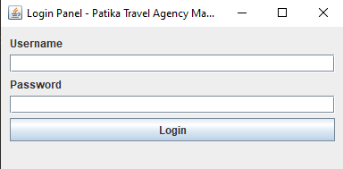
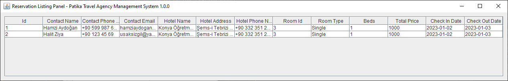

# TravelAgencySoftware
A desktop software for your travel agency with GUI and MySQL Database Configuration.

See our YouTube video: https://youtu.be/Wvr7KoSEWTY
(In Turkish)

## Database Configuration
To start using the software,
you first need to prepare your database.
The very first step is to create a database and tables in MySQL.
After you create your database and scheme,
preferably named `agency`, you need to create the tables.

**If you change the name of the database or the scheme,
you need to change the database name in the code.
You may find more information about it in the section
[Database Connection](#database-connection).**

[Open the `create-tables.sql` file](src/dev/patika/plus/sql/create_tables.sql).
Run it. It will automatically generate the tables for you.
If you want to create the tables manually, you can use the [SQL code](#sql-table-creation-codes) at the bottom of this file to create the tables.

Before starting to use the software,
you may want to test it. For this reason, 
we have included [sample data SQL file](src/dev/patika/plus/sql/sample_data.sql) 
which you can click
and run to insert all the sample data into your database. 
Again, you can also insert the sample data manually.
Check out the [sample data](#sample-data-sql-codes-) section for more information.

## Database Connection
To connect to your database,
you need to change the database connection information in the code.
You can find the database connection information in the [Config.java](src/dev/patika/plus/essential/Config.java) file.

Change the following lines in the `Config.java` file to connect to your database.
```
public static final String URL = "jdbc:mysql://localhost:3306/agency";
public static final String USERNAME = "";
public static final String PASSWORD = "";
```

If you need assistance, please refer to your IT guy.

## First Run
After you have created your database and tables,
you can run the software.
The first GUI to be loaded is Login.



Behind the scenes,
this panel checks your user table in the database
to see if there is any admin user.
If there is no admin user 
(which is generally the case for the first run),
it will ask you to create an admin user.

You will be automatically redirected to the register screen.


You can create your admin user here.
After you create your admin user,
you can login with your admin user.

Admin login gives you access to user management panel
where you can add and edit users.


Either by creating an employee account and logging into that user
or by clicking the `Switch to Employee Panel` button located at the top right corner,
you can access the employee panel.


Employee panel is just a hub for other panels.
There are two key panels in the employee panel:
* Adding and Editing Hotels and related data.
* Reservation Management Panel

## Usage

### Add and Edit Panel


This is your main panel for adding and editing hotels and related data.
You can add and edit hotels, rooms, seasons, and board types.
You can also add and edit hotel facilities and room facilities.

#### Adding and Editing Hotels

The main screen is for hotel-related operations.
If you right click on any of the shown hotels,
you will see a context menu with the following options:
* Add
* Edit
* Delete
* Reload Hotels


##### Adding a Hotel
Either by using the context menu or by clicking the `Add` button located at the bottom left corner,
you can add a new hotel.


You can add a new hotel by filling the form.

If you want to add a new hotel facility,
you can click the `Edit` button near the related label.

This will open up a new window where you can add and edit hotel facilities.


Simply click on the property you want to add or remove and then click on the corresponding button.

Same applies for board types.

##### Editing a Hotel

You can edit a hotel by right-clicking on the hotel you want to edit and then clicking on the `Edit` button.


This will open the same panel as the add hotel panel.
However, there will be some data already filled in.
Do as you like and press `Submit` button to save your changes.

##### Deleting a Hotel

You can delete a hotel by right-clicking on the hotel you want to delete and then clicking on the `Delete` button.
However, it is a work in progress feature.
It will be implemented in the future.

##### Reloading Hotels

You can reload hotels by right-clicking on any hotel and then clicking on the `Reload Hotels` button.
This will reload the hotels table.

##### Managing Seasons

To manage seasons of a hotel, first you need to select the hotel on the table.
If you selected it, its name will appear in the top right corner.


Then, you can click on the `Manage Seasons` button to open the seasons management panel.


You can add and edit seasons here.
Remember that pressing add button will add a new season even if it is already present.
To update a season, you need to select it from the table and then press the update button.

##### Adding and Editing Rooms

To add a room, you need to select a hotel first.
Then, you can click on the `Manage Rooms` button to open the rooms management panel.


Currently, room editing is not implemented.
You can only add rooms.

Be sure to fill all the fields and type prices on the table before submitting.

Adding and editing facilities is the same as hotel facilities.
Go to the [Adding and Editing Hotels](#adding-and-editing-hotels) section for more information if necessary.

### Reservation Panel


This is the main panel for reservation management.
It is a hub for other two panels.

#### Add Reservation Panel


Add reservation panel, or better known as the hotel finder,
lets you find hotels with available rooms for a given date range and guest count.

You can select the start and end dates from the date pickers.
You can also select the adult and child guest count from the spinners.
Please make sure that you filled all the fields before pressing the `Find` button.


After you press the `Find` button,
you will see a list of hotels with available rooms for the given date range and guest count.
To proceed with reservation details, you need to double-click on the hotel row.


This will open up the room selector panel
where you can select the board type and room for reservation.


When you select a room, more information about the room will be shown.
Also you can see the total price for the reservation.

Pressing the `Proceed to Reservation` will take you to
the reservation details panel where you can see the summary of the reservation
and add contact information to complete the reservation.


You can add contact information by filling the form.
After you fill the form,
if everything looks okay,
you can press the `Reserve` button to complete the reservation.

That's it! You have successfully completed a reservation.

Now you can see the reservation in the reservation listing panel.

### Reservation Listing Panel



Here you can see all the reservations.


By right-clicking on a reservation,
you can delete it by selecting the `Delete` option from the context menu.


## References
### SQL Table Creation Codes

```sql
create table hotel
(
    id           int auto_increment
        primary key,
    name         varchar(255) not null,
    province     varchar(55)  null,
    state        varchar(55)  null,
    address      text         not null,
    email        varchar(255) not null,
    phone_number varchar(100) not null,
    stars        int          null,
    facilities   varchar(255) null,
    board_types  varchar(255) null
);

create table pricing
(
    room_id       int null,
    season_id     int null,
    board_type_id int null,
    price_adult   int null,
    price_child   int null
);

create table property
(
    id      int auto_increment
        primary key,
    name    varchar(255)                                                                          null,
    of_type enum ('hotel_facility', 'room_facility', 'board_type', 'room_type', 'age_classifier') null
);

create table reservation
(
    id                   int auto_increment
        primary key,
    hotel_id             int          not null,
    room_id              int          not null,
    board_type_id        int          not null,
    start_date           varchar(255) not null,
    end_date             varchar(255) not null,
    adult_guest_count    int          not null,
    child_guest_count    int          not null,
    total_price          int          not null,
    contact_name         varchar(255) not null,
    contact_phone_number varchar(255) not null,
    contact_email        varchar(255) not null
);

create table room
(
    id         int auto_increment
        primary key,
    hotel_id   int          null,
    of_type    varchar(255) null,
    beds       int          null,
    stock      int          null,
    size       int          null,
    facilities varchar(255) null
);

create index room_hotel_id_fk
    on room (hotel_id);

create table room_availability
(
    room_id int          not null
        primary key,
    amount  int          null,
    date    varchar(255) null
);

create table season
(
    id       int auto_increment
        primary key,
    hotel_id int          not null,
    start    varchar(255) null,
    end      varchar(255) null,
    name     varchar(255) null
);

create index season_hotel_id_fk
    on season (hotel_id);

create table user
(
    id       int auto_increment
        primary key,
    username varchar(255)               not null,
    password varchar(255)               not null,
    of_type  enum ('admin', 'employee') null
);
```

### Sample Data SQL Codes 
```sql
# PROPERTIES
INSERT INTO property (id, name, of_type) VALUES (1, 'Free Parking', 'hotel_facility');
INSERT INTO property (id, name, of_type) VALUES (2, 'Free Wifi', 'hotel_facility');
INSERT INTO property (id, name, of_type) VALUES (3, 'Swimming Pool', 'hotel_facility');
INSERT INTO property (id, name, of_type) VALUES (4, 'Fitness Center', 'hotel_facility');
INSERT INTO property (id, name, of_type) VALUES (5, 'Hotel Concierge', 'hotel_facility');
INSERT INTO property (id, name, of_type) VALUES (6, 'Spa', 'hotel_facility');
INSERT INTO property (id, name, of_type) VALUES (7, 'Room Service', 'hotel_facility');
INSERT INTO property (id, name, of_type) VALUES (8, 'Tv', 'room_facility');
INSERT INTO property (id, name, of_type) VALUES (9, 'Minibar', 'room_facility');
INSERT INTO property (id, name, of_type) VALUES (10, 'Gaming Console', 'room_facility');
INSERT INTO property (id, name, of_type) VALUES (11, 'Safe', 'room_facility');
INSERT INTO property (id, name, of_type) VALUES (12, 'Projection', 'room_facility');
INSERT INTO property (id, name, of_type) VALUES (13, 'Child', 'age_classifier');
INSERT INTO property (id, name, of_type) VALUES (14, 'Adult', 'age_classifier');
INSERT INTO property (id, name, of_type) VALUES (15, 'Single', 'room_type');
INSERT INTO property (id, name, of_type) VALUES (16, 'Double', 'room_type');
INSERT INTO property (id, name, of_type) VALUES (17, 'Suite', 'room_type');
INSERT INTO property (id, name, of_type) VALUES (18, 'Ultra Full Inclusive', 'board_type');
INSERT INTO property (id, name, of_type) VALUES (19, 'Full Inclusive', 'board_type');
INSERT INTO property (id, name, of_type) VALUES (20, 'Room Breakfast', 'board_type');
INSERT INTO property (id, name, of_type) VALUES (21, 'Full Board', 'board_type');
INSERT INTO property (id, name, of_type) VALUES (22, 'Half Board', 'board_type');
INSERT INTO property (id, name, of_type) VALUES (23, 'Room and Bed', 'board_type');
INSERT INTO property (id, name, of_type) VALUES (24, 'Alcohol Excluded Full Board', 'board_type');


# HOTEL
INSERT INTO hotel (name, province, state, address, email, phone_number, stars, facilities, board_types)
VALUES ('İrlanda Kır Evi Inn', 'Hakkari', 'Çukurca', 'İrlandalılar Mah. Romancılar Sok. No 55', 'hello@kirinn.tr', '+90 412 456 9874', 5, '1,2,3,4,', '22,');

INSERT INTO hotel (name, province, state, address, email, phone_number, stars, facilities, board_types)
VALUES ('Mayflower Butik Otel', 'Hakkari', 'Çukurca', 'İrlandalılar Mah. Romancılar Sok. No 43', 'best@mayflowerhotel.com.tr', '+90 412 999 9874', 5, '1,2,', '22,');

INSERT INTO hotel (name, province, state, address, email, phone_number, stars, facilities, board_types)
VALUES ('Otel Mavi Ay', 'Hakkari', 'Çukurca', 'İrlandalılar Mah. Güzide Sok. No 13', 'hey@maviay.com', '+90 123 444 5566', 5, '1,2,4,', '22,');

INSERT INTO hotel (name, province, state, address, email, phone_number, stars, facilities, board_types)
VALUES ('Gökyüzü Butik Otel', 'Hakkari', 'Merkez', 'Hakkı Mah. Zehir Sok. No 3', 'rezervasyon@gokyuzubutikotel.com.tr', '+90 222 333 1234', 5, '1,2,3,4,5,', '22,');

INSERT INTO hotel (name, province, state, address, email, phone_number, stars, facilities, board_types)
VALUES ('Sema Hotel', 'Hakkari', 'Merkez', 'Hakkı Mah. Gök Cad. No 7', 'reserve@sema.com.tr', '+90 345 777 1234', 5, '1,2,3,4,5,', '22,');

INSERT INTO hotel (name, province, state, address, email, phone_number, stars, facilities, board_types)
VALUES ('Bulut Hotel', 'Çanakkale', 'Merkez', 'Boğaz Mah. Bulut Sok. No 666', 'comfy@cloudhotel.com.tr', '+90 666 666 6666', 5, '1,2,3,4,5,', '22,');

INSERT INTO hotel (name, province, state, address, email, phone_number, stars, facilities, board_types)
VALUES ('Balina Mağarası Han', 'Çanakkale', 'Merkez', 'Boğaz Mah. Deve Sok. No 1', 'rezervasyon@balinamagarasihani.com.tr', '+90 987 654 3214', 4, '1,2,3,4,5,', '18,19,22,');

INSERT INTO hotel (name, province, state, address, email, phone_number, stars, facilities, board_types)
VALUES ('Hamidonun Yeri', 'Çanakkale', 'Merkez', 'Kara Mah. Denizliler Sok. No 5', 'hachen@hamidonunyeri.tr', '+90 642 214 4487', 5, '1,2,3,4,5,6,', '18,22,');

INSERT INTO hotel (name, province, state, address, email, phone_number, stars, facilities, board_types)
VALUES ('Kuzey Sahili Butik Otel', 'Sinop', 'Merkez', 'Deniz Mah. Ali Sok. No 654', 'konak@kuzeysahili.com.tr', '+90 748 859 9612', 5, '1,2,3,4,5,', '18,21,22,');

INSERT INTO hotel (name, province, state, address, email, phone_number, stars, facilities, board_types)
VALUES ('Konya Öğretmenevi', 'Konya', 'Karatay', 'Şems-i Tebrizi Mh. Mazhar Babalık Sk. No:3', 'info@konyaogretmenevi.com.tr', '+90 332 351 2265', 4, '1,2,', '21,22,');

INSERT INTO hotel (name, province, state, address, email, phone_number, stars, facilities, board_types)
VALUES ('Hotel Minerva Pazar', 'Rize', 'Pazar', 'Prof. Dr. Mehmet Haberal Caddesi No:9, 53300 Pazar/Rize', 'info@minervapazar.com', '+90 538 470 84 35', 4, '5,1,2,', '22,');

INSERT INTO hotel (name, province, state, address, email, phone_number, stars, facilities, board_types)
VALUES ('Patika Hostel', 'İstanbul', 'Ümraniye', 'Patikaoğlu Mah. Kodluyoruzkızı Sok. No 7', 'hostel@patika.dev', '+90 999 987 6543', 4, '1,2,3,4,5,6,7,', '18,22,');

INSERT INTO hotel (name, province, state, address, email, phone_number, stars, facilities, board_types)
VALUES ('Kodluyoruz Motel', 'Kahramanmaraş', 'Merkez', 'Motorluyoruz Mah. Kod yazamıyoruz Sok.', 'info@kodluyoruz.com', '+90 875 46 2850', 4, '1,2,3,4,5,6,7,', '18,19,20,21,22,23,24,');

# SEASON
INSERT INTO season (hotel_id, name, start, end)
VALUES (1, 'One Season to Rule Them All', '2021-01-01', '2034-01-01');

INSERT INTO season (hotel_id, name, start, end)
VALUES (2, 'One Season to Rule Them All', '2021-01-01', '2034-01-01');

INSERT INTO season (hotel_id, name, start, end)
VALUES (3, 'One Season to Rule Them All', '2021-01-01', '2034-01-01');

INSERT INTO season (hotel_id, name, start, end)
VALUES (4, 'One Season to Rule Them All', '2021-01-01', '2034-01-01');

INSERT INTO season (hotel_id, name, start, end)
VALUES (5, 'One Season to Rule Them All', '2021-01-01', '2034-01-01');

INSERT INTO season (hotel_id, name, start, end)
VALUES (6, 'One Season to Rule Them All', '2021-01-01', '2034-01-01');

INSERT INTO season (hotel_id, name, start, end)
VALUES (7, 'One Season to Rule Them All', '2021-01-01', '2034-01-01');

INSERT INTO season (hotel_id, name, start, end)
VALUES (8, 'One Season to Rule Them All', '2021-01-01', '2034-01-01');

INSERT INTO season (hotel_id, name, start, end)
VALUES (9, 'One Season to Rule Them All', '2021-01-01', '2034-01-01');

INSERT INTO season (hotel_id, name, start, end)
VALUES (10, 'One Season to Rule Them All', '2021-01-01', '2034-01-01');

INSERT INTO season (hotel_id, name, start, end)
VALUES (11, 'One Season to Rule Them All', '2021-01-01', '2034-01-01');

INSERT INTO season (hotel_id, name, start, end)
VALUES (12, 'One Season to Rule Them All', '2021-01-01', '2034-01-01');

INSERT INTO season (hotel_id, name, start, end)
VALUES (13, 'One Season to Rule Them All', '2021-01-01', '2034-01-01');

# ROOM
INSERT INTO room (hotel_id, of_type, beds, stock, size, facilities)
VALUES (1, 'Single', 1, 10, 30, '8,9,');

INSERT INTO room (hotel_id, of_type, beds, stock, size, facilities)
VALUES (2, 'Single', 1, 10, 30, '8,9,10,11,');

INSERT INTO room (hotel_id, of_type, beds, stock, size, facilities)
VALUES (3, 'Single', 1, 10, 30, '8,9,10,11,');

INSERT INTO room (hotel_id, of_type, beds, stock, size, facilities)
VALUES (4, 'Single', 1, 10, 30, '8,9,10,11,12,');

INSERT INTO room (hotel_id, of_type, beds, stock, size, facilities)
VALUES (5, 'Single', 1, 10, 30, '8,9,10,11,12,');

INSERT INTO room (hotel_id, of_type, beds, stock, size, facilities)
VALUES (6, 'Single', 1, 10, 30, '8,9,10,11,12,');

INSERT INTO room (hotel_id, of_type, beds, stock, size, facilities)
VALUES (7, 'Single', 1, 10, 30, '8,9,10,11,12,');

INSERT INTO room (hotel_id, of_type, beds, stock, size, facilities)
VALUES (8, 'Single', 1, 10, 30, '8,9,10,11,12,');

INSERT INTO room (hotel_id, of_type, beds, stock, size, facilities)
VALUES (9, 'Single', 1, 10, 30, '8,9,10,11,12,');

INSERT INTO room (hotel_id, of_type, beds, stock, size, facilities)
VALUES (10, 'Single', 1, 10, 30, '8,9,10,11,12,');

INSERT INTO room (hotel_id, of_type, beds, stock, size, facilities)
VALUES (11, 'Single', 1, 10, 30, '8,9,10,11,12,');

INSERT INTO room (hotel_id, of_type, beds, stock, size, facilities)
VALUES (12, 'Single', 1, 10, 30, '8,9,10,11,12,');

INSERT INTO room (hotel_id, of_type, beds, stock, size, facilities)
VALUES (13, 'Single', 1, 10, 30, '8,9,10,11,12,');

INSERT INTO room (hotel_id, of_type, beds, stock, size, facilities)
VALUES (1, 'Double', 1, 1, 30, '8,9,10,11,12,');

INSERT INTO room (hotel_id, of_type, beds, stock, size, facilities)
VALUES (2, 'Double', 1, 1, 30, '8,9,10,11,12,');

INSERT INTO room (hotel_id, of_type, beds, stock, size, facilities)
VALUES (3, 'Double', 1, 1, 30, '8,9,10,11,12,');

INSERT INTO room (hotel_id, of_type, beds, stock, size, facilities)
VALUES (4, 'Double', 1, 1, 30, '8,9,10,11,12,');

INSERT INTO room (hotel_id, of_type, beds, stock, size, facilities)
VALUES (5, 'Double', 1, 1, 30, '8,9,10,11,12,');

INSERT INTO room (hotel_id, of_type, beds, stock, size, facilities)
VALUES (6, 'Double', 1, 1, 30, '8,9,10,11,12,');

INSERT INTO room (hotel_id, of_type, beds, stock, size, facilities)
VALUES (7, 'Double', 1, 1, 30, '8,9,10,11,12,');

INSERT INTO room (hotel_id, of_type, beds, stock, size, facilities)
VALUES (8, 'Double', 1, 1, 30, '8,9,10,11,12,');

INSERT INTO room (hotel_id, of_type, beds, stock, size, facilities)
VALUES (9, 'Double', 1, 1, 30, '8,9,10,11,12,');

INSERT INTO room (hotel_id, of_type, beds, stock, size, facilities)
VALUES (10, 'Double', 1, 1, 30, '8,9,10,11,12,');

INSERT INTO room (hotel_id, of_type, beds, stock, size, facilities)
VALUES (11, 'Double', 1, 1, 30, '8,9,10,11,12,');

INSERT INTO room (hotel_id, of_type, beds, stock, size, facilities)
VALUES (12, 'Double', 1, 1, 30, '8,9,10,11,12,');

INSERT INTO room (hotel_id, of_type, beds, stock, size, facilities)
VALUES (13, 'Double', 1, 1, 30, '8,9,10,11,12,');

INSERT INTO room (hotel_id, of_type, beds, stock, size, facilities)
VALUES (1, 'Suite', 1, 2, 30, '8,9,10,11,12,');

INSERT INTO room (hotel_id, of_type, beds, stock, size, facilities)
VALUES (2, 'Suite', 1, 2, 30, '8,9,10,11,12,');

INSERT INTO room (hotel_id, of_type, beds, stock, size, facilities)
VALUES (3, 'Suite', 1, 2, 30, '8,9,10,11,12,');

INSERT INTO room (hotel_id, of_type, beds, stock, size, facilities)
VALUES (4, 'Suite', 1, 2, 30, '8,9,10,11,12,');

INSERT INTO room (hotel_id, of_type, beds, stock, size, facilities)
VALUES (5, 'Suite', 1, 2, 30, '8,9,10,11,12,');

INSERT INTO room (hotel_id, of_type, beds, stock, size, facilities)
VALUES (6, 'Suite', 1, 2, 30, '8,9,10,11,12,');

INSERT INTO room (hotel_id, of_type, beds, stock, size, facilities)
VALUES (7, 'Suite', 1, 2, 30, '8,9,10,11,12,');

INSERT INTO room (hotel_id, of_type, beds, stock, size, facilities)
VALUES (8, 'Suite', 1, 2, 30, '8,9,10,11,12,');

INSERT INTO room (hotel_id, of_type, beds, stock, size, facilities)
VALUES (9, 'Suite', 1, 2, 30, '8,9,10,11,12,');

INSERT INTO room (hotel_id, of_type, beds, stock, size, facilities)
VALUES (10, 'Suite', 1, 2, 30, '8,9,10,11,12,');

INSERT INTO room (hotel_id, of_type, beds, stock, size, facilities)
VALUES (11, 'Suite', 1, 2, 30, '8,9,10,11,12,');

INSERT INTO room (hotel_id, of_type, beds, stock, size, facilities)
VALUES (12, 'Suite', 1, 2, 30, '8,9,10,11,12,');

INSERT INTO room (hotel_id, of_type, beds, stock, size, facilities)
VALUES (13, 'Suite', 1, 2, 30, '8,9,10,11,12,');

# PRICING
INSERT INTO pricing (room_id, season_id, board_type_id, price_adult, price_child)
VALUES (1, 1, 22, 666, 333);

INSERT INTO pricing (room_id, season_id, board_type_id, price_adult, price_child)
VALUES (2, 2, 22, 666, 333);

INSERT INTO pricing (room_id, season_id, board_type_id, price_adult, price_child)
VALUES (3, 3, 22, 666, 333);

INSERT INTO pricing (room_id, season_id, board_type_id, price_adult, price_child)
VALUES (4, 4, 22, 666, 333);

INSERT INTO pricing (room_id, season_id, board_type_id, price_adult, price_child)
VALUES (5, 5, 22, 666, 333);

INSERT INTO pricing (room_id, season_id, board_type_id, price_adult, price_child)
VALUES (6, 6, 22, 666, 333);

INSERT INTO pricing (room_id, season_id, board_type_id, price_adult, price_child)
VALUES (7, 7, 22, 666, 333);

INSERT INTO pricing (room_id, season_id, board_type_id, price_adult, price_child)
VALUES (8, 8, 22, 666, 333);

INSERT INTO pricing (room_id, season_id, board_type_id, price_adult, price_child)
VALUES (9, 9, 22, 666, 333);

INSERT INTO pricing (room_id, season_id, board_type_id, price_adult, price_child)
VALUES (10, 10, 22, 666, 333);

INSERT INTO pricing (room_id, season_id, board_type_id, price_adult, price_child)
VALUES (11, 11, 22, 666, 333);

INSERT INTO pricing (room_id, season_id, board_type_id, price_adult, price_child)
VALUES (12, 12, 22, 666, 333);

INSERT INTO pricing (room_id, season_id, board_type_id, price_adult, price_child)
VALUES (13, 13, 22, 666, 333);

INSERT INTO pricing (room_id, season_id, board_type_id, price_adult, price_child)
VALUES (14, 1, 22, 666, 333);

INSERT INTO pricing (room_id, season_id, board_type_id, price_adult, price_child)
VALUES (15, 2, 22, 666, 333);

INSERT INTO pricing (room_id, season_id, board_type_id, price_adult, price_child)
VALUES (16, 3, 22, 666, 333);

INSERT INTO pricing (room_id, season_id, board_type_id, price_adult, price_child)
VALUES (17, 4, 22, 666, 333);

INSERT INTO pricing (room_id, season_id, board_type_id, price_adult, price_child)
VALUES (18, 5, 22, 666, 333);

INSERT INTO pricing (room_id, season_id, board_type_id, price_adult, price_child)
VALUES (19, 6, 22, 666, 333);

INSERT INTO pricing (room_id, season_id, board_type_id, price_adult, price_child)
VALUES (20, 7, 22, 666, 333);

INSERT INTO pricing (room_id, season_id, board_type_id, price_adult, price_child)
VALUES (21, 8, 22, 666, 333);

INSERT INTO pricing (room_id, season_id, board_type_id, price_adult, price_child)
VALUES (22, 9, 22, 666, 333);

INSERT INTO pricing (room_id, season_id, board_type_id, price_adult, price_child)
VALUES (23, 10, 22, 666, 333);

INSERT INTO pricing (room_id, season_id, board_type_id, price_adult, price_child)
VALUES (24, 11, 22, 666, 333);

INSERT INTO pricing (room_id, season_id, board_type_id, price_adult, price_child)
VALUES (25, 12, 22, 666, 333);

INSERT INTO pricing (room_id, season_id, board_type_id, price_adult, price_child)
VALUES (26, 13, 22, 666, 333);

INSERT INTO pricing (room_id, season_id, board_type_id, price_adult, price_child)
VALUES (27, 1, 22, 666, 333);

INSERT INTO pricing (room_id, season_id, board_type_id, price_adult, price_child)
VALUES (28, 2, 22, 666, 333);

INSERT INTO pricing (room_id, season_id, board_type_id, price_adult, price_child)
VALUES (29, 3, 22, 666, 333);

INSERT INTO pricing (room_id, season_id, board_type_id, price_adult, price_child)
VALUES (30, 4, 22, 666, 333);

INSERT INTO pricing (room_id, season_id, board_type_id, price_adult, price_child)
VALUES (31, 5, 22, 666, 333);

INSERT INTO pricing (room_id, season_id, board_type_id, price_adult, price_child)
VALUES (32, 6, 22, 666, 333);

INSERT INTO pricing (room_id, season_id, board_type_id, price_adult, price_child)
VALUES (33, 7, 22, 666, 333);

INSERT INTO pricing (room_id, season_id, board_type_id, price_adult, price_child)
VALUES (34, 8, 22, 666, 333);

INSERT INTO pricing (room_id, season_id, board_type_id, price_adult, price_child)
VALUES (35, 9, 22, 666, 333);

INSERT INTO pricing (room_id, season_id, board_type_id, price_adult, price_child)
VALUES (36, 10, 22, 666, 333);

INSERT INTO pricing (room_id, season_id, board_type_id, price_adult, price_child)
VALUES (37, 11, 22, 666, 333);

INSERT INTO pricing (room_id, season_id, board_type_id, price_adult, price_child)
VALUES (38, 12, 22, 666, 333);

INSERT INTO pricing (room_id, season_id, board_type_id, price_adult, price_child)
VALUES (39, 13, 22, 666, 333);
```